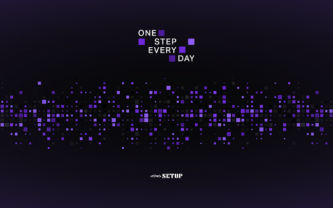

<h1 align="center">
    
</h1>

 

  

## 🚀 Tecnologias

Esse projeto foi desenvolvido com as seguintes tecnologias:

- [React](https://reactjs.org)
- [React Native](https://facebook.github.io/react-native/)
- [Expo](https://expo.io/)
- [TypeScript](https://www.typescriptlang.org/)
- [Prisma](https://www.prisma.io/)

## 💻 Projeto

Aplicação desenvolvida durante o NLW Setup - Ignite #RocketSeat

## 💻 Layout

Layout do projeto desenvolvido na trilha Ignite do NLW Setup da Rocketseat. é necessário ter uma conta no Figma.

https://www.figma.com/community/file/1195326661124171197